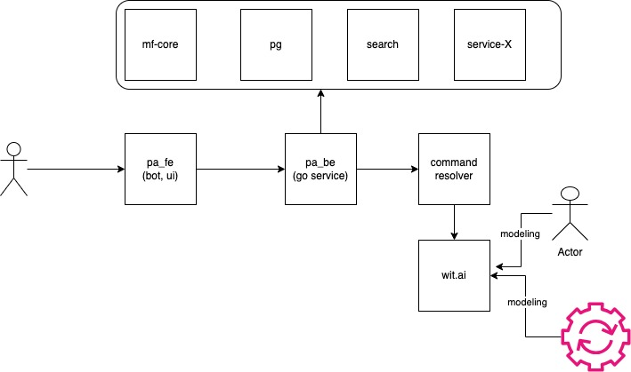
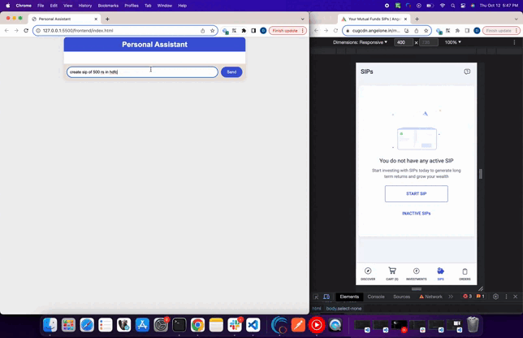

### Team personal_assistant_for_investment
A chatbot to assist the user in their investment journey.

-------------------------------------------------------------------------------------------------

### Idea
## Problem statement
Traditional way of investment needs lots of learning curve and with new gen investors drop of chances are more . For example creating an SIP user has to go through many steps and it is like filling the form.
Similarly placing a buy/sell or GTT order is like filling a form and with lot technical terms it is sometime confusing also. We need a smart way of invetsment and at some level assistant or hand holding for the user.

## Solution -> PA-I
Here comes the personal assistant for investment (PA-I) . We should build intelligent software which can access user input in plain English with minimal jargons and complete the tasks. For example, in order to place an SIP 
user can simply ask the assistant to "place sip" or "notify me when new fund lauched" or "sell the scrip when bullish" and more.

## How it impact the business
1. This is one of new Gen kind and we will be first to market (if not first we can be best)
2. Targeting the 3rd tier cities investors wil multi language model
3. Reduce the learning curve for users
4. Automate the investments and reduce the human errors

For complete idea please follow the doc below
https://drive.google.com/open?id=1mH4CXLE97eRlObFme6PGUZFwy_ERxAkX-bIevZMH-34

--------------------------------------------------------------------------------------------------

### High Level setup


--------------------------------------------------------------------------------------------------

### Steps to Run
```
   git clone https://github.com/kush27082000/personal-assistant.git

   cd hack23_personal_assistant

   ### update env.sh file with api keys
   source ./env.sh

   cd backend
   go run main.go
   ### above command will start the application on 8080

   cd ..
   cd frontend
   ### open the index.html on any browser
```    

-------------------------------------------------------------------------------------------------

### Participants  
   Deepti Mathur
   
   Kushagra Soni
   
   Girish Bhat
   
   Rohith Miryala

-------------------------------------------------------------------------------------------------

### Demo Video
   
